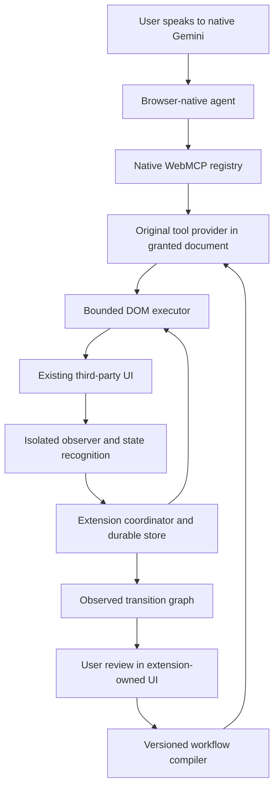
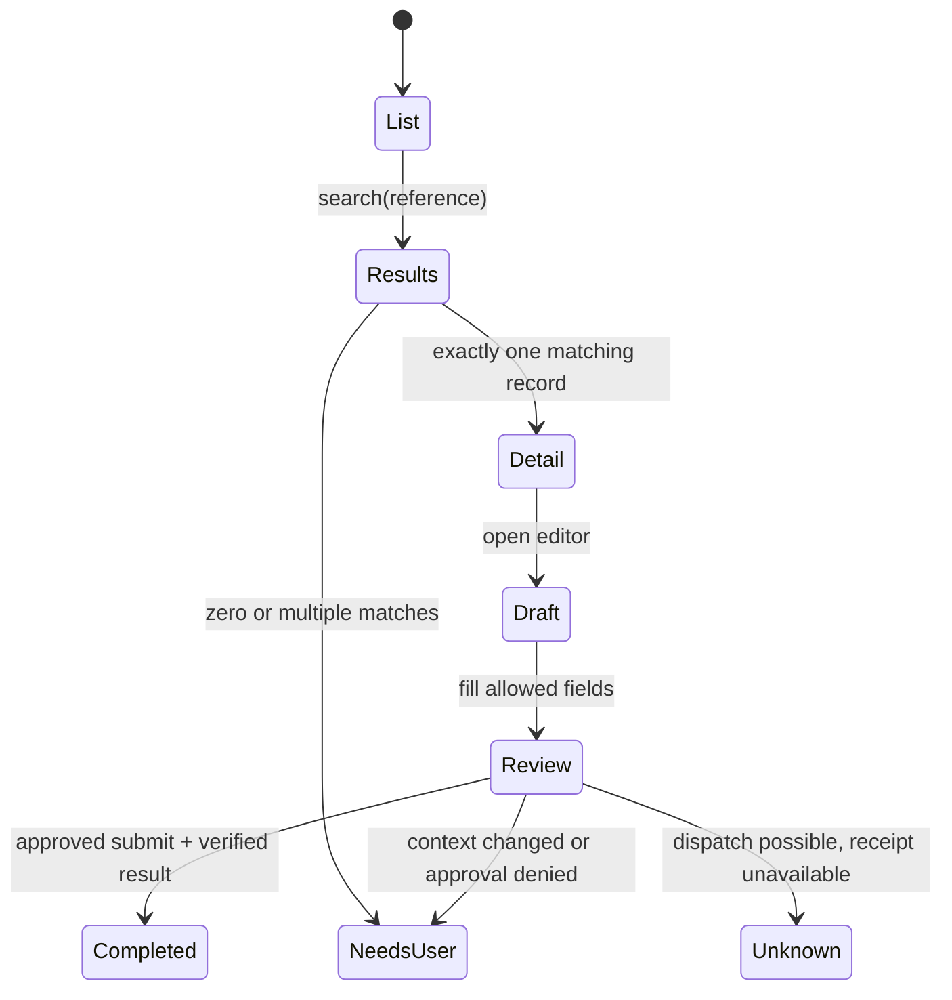

# WebMCP Workflow Bridge: central design and implementation plan

**Date:** October 4, 2026. **Status:** longer-term architecture reference. The user subsequently requested a much smaller hackathon implementation; follow the [hackathon plan](superpowers/plans/2026-10-04-hackathon-mvp.md) and [current progress](IMPLEMENTATION_LOG.md) for implemented scope. **Repository:** `/Users/sri/Documents/ChatGPT/webmcp-workflow-bridge`. This is a descriptive directory name, not a final brand.

## 1. The product in one sentence

**An extension that gives the browser's existing agent usable tools for a supported website, then remembers reviewed ways of completing tasks there.**

The user speaks to Gemini in Chrome. Our extension does not provide another chatbot, another model subscription, or a replacement browser. It supplies structured page capabilities, captures what actually happened, and packages approved successful paths as reusable workflow tools.

A useful interaction should eventually be:

> “Find the Acme support case, set its priority to High, and leave the update ready for my review.”

On the first run, the agent uses available page capabilities while the extension records relevant UI transitions. The user can name and save the successful path. On a later run, Gemini can discover a more specific tool such as `prepare_case_update(customer, priority)`. A guarded executor follows the approved path and verifies its result.

A read-only page can become easier to inspect, search, filter or navigate. An inert page cannot acquire nonexistent business functions merely because the extension registers a tool. We expose and compose capabilities the underlying UI actually has.

## 2. Confirmed requirements and explicit assumptions

### Confirmed by the user

1. The product must operate on third-party websites through an extension; site owners need not edit their application.
2. The agent should be the browser's existing agent, with Gemini in Chrome the first target.
3. Successful interactions should contribute to a graph of states and transitions, and users should be able to save workflows.
4. No third-party runtime libraries or open-source application implementations may ship in the product. Standard build/test tools are permitted.
5. Begin in a new repository; leave the earlier `curis` implementation separate.
6. Produce a thorough, centralized plan before substantial implementation.
7. Capture structured UI events rather than the screen. The extension does not record video, take screenshots, analyze pixels or request screen-capture permissions.

### Recommended scope decisions

- Start with Chrome desktop, an explicitly supported build/channel, one active tab and one approved HTTPS origin per workflow.
- Preserve UI-only execution from the earlier concept: no reverse-engineered application endpoints, fetch/XHR replay, private framework stores, or business API adapters.
- Use native WebMCP, original extension code, native browser storage, and a small original DOM interpreter.
- Start with navigation, search, structured reads and draft preparation. Add one reversible write only after approval and uncertain-outcome handling work.
- Target two or three permitted third-party administrative applications with normal DOM controls. A general architecture does not require claiming universal coverage at launch.
- Recording is explicitly enabled for a task; there is no indiscriminate background browsing history capture.

These are product choices. They do not require abandoning the extension requirement or modifying the target website's source.

## 3. Feasibility: the buildable pieces and the external dependency

### Pieces we can build

- An extension can inspect ordinary DOM controls and observe changes in a granted page.
- Original code can generate bounded candidate descriptions, schemas and executable DOM actions.
- Original code can record events, infer candidate state abstractions, parameterize demonstrated values, validate workflow data and execute guarded steps.
- A workflow can be exported as versioned JSON and represented in a graph without a graph or state-machine library.
- Native WebMCP can provide the agent-facing transport where the browser implements it.

### The decisive uncertainty

**Native WebMCP support and native Gemini consumption are different things.** Chrome's October 1 documentation distinguishes its inspector's Gemini-powered chat from Gemini in Chrome. Google's May announcement described Gemini support as forthcoming. That is not enough to claim the user's native agent consumes extension-registered tools today. [Chrome overview](https://developer.chrome.com/docs/ai/webmcp), [I/O announcement](https://developer.chrome.com/blog/chrome-at-io26).

The current documented provider surface is `document.modelContext`, not the old `navigator.modelContext` examples. A build-specific adapter is necessary because documentation can describe behavior ahead of broad Stable. [Imperative API](https://developer.chrome.com/docs/ai/webmcp/imperative-api).

The extension has a plausible experimental access route on third-party pages: Chrome documents third-party origin-trial tokens for content scripts, and WebMCP feature metadata currently indicates third-party support. An extension manifest token alone is insufficient. This must be tested with a valid token, stable extension ID and the exact browser build. [Extension trial guide](https://developer.chrome.com/docs/extensions/how-to/web-platform/origin-trials), [feature metadata](https://chromestatus.com/api/v0/features/5117755740913664).

### Gate 0: prove the actual product boundary first

Before building a general scanner or a graph editor, implement a tiny diagnostic extension with original code:

1. Record the Chrome build/channel, OS, native Gemini availability, feature configuration and extension ID. Treat Gemini/auto-browse entitlement separately from WebMCP support.
2. On a permitted HTTPS test page, expose one harmless tool. On invocation it creates a fresh receipt and makes a benign visible change. It must not read secrets or mutate application data.
3. Test isolated-world registration first. Current Chromium source supports isolated callback contexts, but installed-build behavior and native-agent visibility still require proof. Use a small MAIN-world registrar only if measured compatibility requires it. [Chromium implementation](https://chromium.googlesource.com/chromium/src/+/HEAD/third_party/blink/renderer/core/script_tools/model_context.cc).
4. Confirm native registration and direct tool execution using our own diagnostic harness or built-in developer UI. Mark that result **provider plumbing only**.
5. Ask the real Gemini-in-Chrome interface to perform the harmless action. Require an invocation record and the matching newly generated receipt; a chat claim or unrelated DOM click does not pass.
6. Repeat on a third-party page with no site-authored WebMCP. Compare a development-flag environment with an ordinary release-channel environment using a valid third-party trial token.
7. Repeat after reload, same-origin navigation, SPA navigation and extension disable/re-enable. Confirm missing API, missing grant and invalid/expired trial produce honest unavailable states.
8. Record whether cancellation, result delivery and tool rediscovery work. Keep proof artifacts and an exact compatibility matrix.

**Pass:** the required extension → native WebMCP → actual Gemini → callback → visible result chain is observed on the supported configuration.

**Fail:** record which boundary failed. Do not silently introduce a Gemini API chat, MCP relay, polyfill or a different agent and call it the requested product. Such alternatives could be separate decisions, not evidence that this gate passed.

Invocation logs demonstrate interoperability in controlled experiments. They do not constitute cryptographic attestation that every future caller is Gemini or has user approval.

## 4. Simplify the product into four jobs

### Job A — Describe what is usable now

Turn the visible, supported portion of the current page into a bounded capability inventory. Include names, roles, field constraints, scope and current availability. Avoid dumping the full DOM into the model.

### Job B — Perform and verify an action

Resolve the current target, check the grant and state, perform an ordinary UI operation, and observe its postcondition. Report what actually happened, including ambiguity and uncertainty.

### Job C — Remember observed transitions

Store a redacted event record linking the prior task state, action, arguments, result and next task state. Mark failed and uncertain transitions as well as successful ones.

Capture meaningful interactions such as click, input/change and submit, together with navigation and selected DOM changes. Each record includes the supported target's role/name/label, relevant parent or form context, sanitized route, permitted value or parameter binding, and small before/after state summaries. Coalesce typing into field edits; do not store a raw keystroke stream. Filter sensitive fields before persistence or tool output.

For example: button activation → target named “Create Snapshot” → dialog named “Create Snapshot” appeared. This structured transition supplies the information needed for learning and verification. A click event alone establishes that an interaction occurred, not that the intended result followed. Observe relevant DOM predicates to distinguish success, validation errors and missing results. No image capture is involved, and full DOM dumps are unnecessary.

### Job D — Save and reuse a reviewed path

Let the user choose a task, replace example values with parameters, review the write boundary and expected result, and publish a versioned workflow tool for that site/account context.

These jobs determine the modules and build sequence. A graph canvas, cloud backend and marketplace are unnecessary for proving them.

## 5. Three architectural approaches considered

| Approach | Benefit | Limitation | Decision |
|---|---|---|---|
| Automatically expose every clickable element | Fast bootstrap; little setup | Poor intent, tool overload, ambiguous risk, weak stability | Do not use as the product contract. Use a bounded inventory internally. |
| Hand-author adapters for every site | Strong semantics on each supported app | Becomes a continuing integration service | Allow small reviewed compatibility profiles, not a large initial adapter catalog. |
| Discover a narrow control subset, observe actual use, review and compile paths | Reduces repeated reasoning while preserving evidence | Requires review and explicit support limits | Recommended architecture. |

A site-owner SDK could be more reliable because it can call application logic, but it fails the user's third-party requirement. It is not the recommended V1.

## 6. User experience

### First use

1. User visits a supported third-party site and clicks **Enable here** in the extension toolbar.
2. The extension shows the granted origin, capability support and native-agent compatibility status.
3. User selects **Learn this task**. Capture begins only for the selected tab and task.
4. User asks Gemini for the task, or performs the task manually. Both can contribute observations. Actions outside our tools have unknown actor attribution unless there is reliable evidence; we do not pretend to know Gemini's private intent.
5. Extension shows a short progress strip: current task state, next verified action and any handoff. The browser remains visibly in use.
6. At completion, the user sees **Save as workflow** with a concise preview.

### Workflow review

Show only decisions that change execution:

- Name and plain-language outcome.
- Inputs and their types; which values remain fixed.
- Site and workspace/account scope.
- Ordered actions with expected results.
- Any branch or bounded loop that has actual evidence.
- Consequential step and approval requirement, if present.
- What counts as success, and what produces an unknown outcome.

The graph is an optional inspection view. The default view is a readable step list. The user should not need to understand finite-state machines to save a workflow.

### Reuse

1. On a later visit, the extension registers appropriate saved tools for the current grant and state.
2. User asks Gemini for the task using new inputs.
3. Gemini chooses the workflow tool; our engine validates and freezes arguments. An applicable bounded authorization permits execution; otherwise the call creates a pending proposal for review in the extension UI.
4. When approval is required, the extension's trusted popup/options UI presents the exact record and proposed changes.
5. Runtime returns verified completion, a reasoned handoff, or uncertainty. It never interprets “click dispatched” as “business task finished.”

The extension uses a toolbar popup and extension-owned management page. It does not require a second conversational side panel competing with Gemini's interface.

### Human takeover

A visible Stop/Take over control stops further dispatch. After a consequential action was sent, the extension can finish bounded verification but cannot promise rollback. Unrelated trusted user input during replay pauses the run, except explicitly requested approval/authentication input. V1 uses this conservatively because native agent input and human input may not be reliably distinguishable.

## 7. Extension architecture and trust boundaries



### Coordinator: extension service worker

Owns grants, workflow versions, active runs, persistent checkpoints and tab ownership. It responds to events; it is not assumed to stay alive. Use browser-provided sender/tab/frame/document identity, not identity fields supplied by page messages.

### Isolated document runtime

Owns DOM observation, target resolution, supported UI operations and state recognition. Prefer registering WebMCP callbacks here if Gate 0 proves that the native agent can discover them. This keeps original callbacks and bookkeeping out of the page's ordinary JavaScript world.

### Optional MAIN-world registration adapter

Only needed if a tested browser combination requires it. It contains no extension credentials or generic extension API bridge. It forwards only a finite, validated request vocabulary to the isolated runtime. Page messages remain untrusted even with source checks and correlation IDs.

### Extension-owned review UI

Owns activation, workflow publication, import/export, sensitive approval and local data deletion. Use native HTML, CSS and Web Components as needed. A page overlay may show progress but is not the authority for sensitive approval: the page can imitate or interfere with page UI.

### Persistent store

Use extension-origin IndexedDB for transactional graphs, workflow versions and run journals. Use extension storage for small preferences and short-lived session/grant metadata. Restrict storage access to trusted extension contexts wherever supported. The target site cannot receive the full store through a tool.

### Important authority limit

A WebMCP tool can be callable from page JavaScript in supported contexts. A native tool callback is therefore not proof of user approval. Our tools cannot accept `approved: true`, arbitrary selectors, arbitrary JavaScript, arbitrary URLs, cookie requests or privileged extension API names.

Authorize a bounded run in extension-owned state. Separate durable **run authorization** from a disposable **document execution lease**. Run authorization binds to origin, tab, workflow revision, allowed target context and immutable arguments. A document lease additionally binds dispatch to the current browser-derived document identity and executor generation. Hints such as `consequentialHint` supplement this enforcement; they do not replace it. [Tool security](https://developer.chrome.com/docs/ai/webmcp/secure-tools), [extension security](https://developer.chrome.com/docs/extensions/develop/security-privacy/stay-secure).

### How a run becomes authorized

Enabling a site and publishing a workflow do not authorize every future invocation or argument. A call without applicable authorization creates a non-executing pending proposal. Trusted extension UI shows the workflow, target context, frozen arguments and allowed effects; acceptance arms a single bounded run. Approval has an expiry and invocation limit, is consumed transactionally, and rejects changed arguments. A separate confirmation can still be required at the actual write boundary after the target is resolved.

For useful low-friction reads/navigation, the user may explicitly configure a standing policy for a narrow class of operations: specified origin/workspace, tool revisions, allowed input ranges or resource filters, output fields, session duration and invocation limits. The same checks apply to bootstrap primitives. Unknown effects, unreviewed autosave behavior and consequential writes do not inherit a broad read/navigation policy. The UI must explain that page scripts may invoke tools within that policy too; the policy grants bounded capability, not authenticated Gemini identity.

On navigation, only the coordinator can issue a replacement document lease after browser-observed document identity, expected transition, effective site permission and workspace checks pass. The durable authorization does not expand to another origin or account. An incoming page callback cannot renew or widen its own authority.

**We cannot force Gemini to use only our tools.** Gemini may retain independent UI actuation. Our policy guarantees concern our executor, not a browser-wide prohibition on everything the agent can do.

## 8. Page understanding without a third-party runtime

### Supported elements initially

- Native links and buttons with meaningful labels.
- Text, numeric, date and email inputs, subject to field policy.
- Native select, checkbox and radio controls.
- Standard forms, dialogs and readable lists/tables.
- Ordinary DOM inside open shadow roots when explicitly supported and tested.

Support accessible-name computation only for a documented subset: explicit labels, `aria-label`, `aria-labelledby`, ordinary native text alternatives and relevant role semantics. Do not claim a complete accessibility-tree implementation. Complex or contradictory naming produces an unsupported/needs-review result.

### Inventory representation

Each candidate receives an opaque, document-scoped control ID, role, bounded name, context landmarks, current enabled/visible state, supported action types and field constraints. IDs expire when their document/state generation changes. CSS selectors and node references are implementation details; agents cannot supply arbitrary selectors.

### Discover, do not invent

A control named “Continue” is not automatically a purchase or a harmless navigation. A button named “Save” is not inherently reversible. Unknown effect classification requires review. One success does not authorize all future contexts.

Build useful structured tool descriptions from observed labels and reviewed intent. Gemini may propose a name or parameterization through an explicit proposal tool, but the extension must not assume it can privately call Gemini's internal reasoning API.

### Resolution and validation

1. Exact current-state identifier when still valid.
2. Reviewed semantic signature: role/name + nearby context + route/state predicates.
3. Reviewed alias or compatibility profile for an already known change.
4. Exactly one valid target, with visibility, enablement and relevant identity checks.
5. Otherwise stop and show the reason.

Do not accept a guessed match merely because it has the highest numerical score. A confidence rank is useful for review, not authority for an unapproved write.

### Waits

Use mutation observations and explicit postconditions with bounded deadlines. A short quiet interval is a debounce, not proof of completion. Loading spinners, overlays and native form validation are part of actionability. Continuous polling/UI animation must not prevent a bounded exit.

### UI-only meaning

The executor clicks, fills, selects, focuses, scrolls and submits supported controls. The website may make its normal network calls because those UI actions trigger them. The extension itself does not discover or call private business endpoints. Direct hidden state mutation is also out of scope.

Synthetic DOM events do not provide arbitrary trusted input. A site requiring trusted activation, native file dialogs or security prompts needs human/native handoff rather than an automatic permission escalation. [MDN input trust](https://developer.mozilla.org/en-US/docs/Web/API/Event/isTrusted).

## 9. WebMCP tool design

Use two layers, not hundreds of button-specific tools.

### Bootstrap capabilities

Illustrative original names:

- `ui.describe_state`: bounded state and allowed-control inventory; page-derived output marked untrusted.
- `ui.prepare_fields`: fill only allowed current-state fields; no implicit submission.
- `ui.activate_control`: activate a current reviewed control under an applicable grant; unknown effects require approval.
- `workflow.status`: return the caller's current scoped run status.

Risk review applies to primitives as well as saved workflows. A generic tool must not become an unrestricted DOM interpreter hidden behind a safe-sounding name.

### Learned business capabilities

After review, publish names such as:

- `workflow.find_case(customer, reference)`
- `workflow.prepare_case_update(reference, priority)`
- `workflow.collect_report(filters)`

Register only tools useful for the current origin, grant and supported start state. Keep discovery small; initially target roughly 3–8 tools, a design budget rather than a protocol limit. Prefer explicit purpose and a short schema over a raw DOM dump. [WebMCP best practices](https://developer.chrome.com/docs/ai/webmcp/best-practices).

### Native API adapter

A small module handles feature detection, registration cleanup, call serialization and execution cancellation for the pinned browser builds. Feature support is checked directly. Unsupported native functionality produces a capability report; no polyfill is presented as native integration.

Use our own narrow TypeScript declarations for the tested API surface. Do not bundle a WebMCP library or type helper runtime. Keep the declarative-form API as a later option; injecting form semantics and auto-submit attributes into arbitrary third-party forms is not required for V1.

### Result contract

Our interpreter uses explicit internal outcomes:

| Outcome | Meaning |
|---|---|
| `started` | A durable run exists; completion is not yet established. |
| `action_complete` | One bounded action's postcondition is satisfied. |
| `needs_user` | Approval, authentication, ambiguity resolution or unsupported control requires handoff. |
| `blocked` | No further authorized/supported action is available. |
| `task_complete` | The reviewed task-level completion evidence is satisfied. |
| `outcome_unknown` | An action may have committed; safe repeat cannot be established. |
| `cancelled` | Further dispatch was stopped; already-observed effects remain. |

Tool outputs include a bounded explanation, current run/step reference and permitted evidence. They do not include browser secrets or unrelated page contents.

## 10. The graph: observed task states, not the whole website

Use an **extended finite-state model**: named observable states plus typed context and guarded transitions. Internally this is plain data structures, not a dependency on a state-machine library.

### State abstraction

A state description combines:

- Origin and reviewed route pattern.
- Current page/task landmarks and dialog context.
- Relevant control availability and form state.
- Expected workspace/account identity boundary where observable.
- Explicit facts such as `one_match`, `many_matches`, `loading`, `review_open` or `session_expired`.

Do not use a whole-DOM hash as state identity. Dynamic timestamps and incidental content would create endless states. Do not use URL alone: the same URL can show a different dialog, account or permission state.

A record's name, ID, date and amount generally belong in bound context, not separate structural states. Values that change allowed behavior still need predicates. For example, “record absent” is a meaningful state; every possible search string is not.

### Transition record

Store:

- Before-state signature and its evidence version.
- Action kind, semantic target and parameter binding.
- Preconditions and approval classification.
- Observed next state and verified postconditions.
- Evidence references, timestamp, duration and executor version.
- Source: our tool, explicit manual capture, or unknown external interaction.
- Success/failure/uncertainty, with counters and last verification.

### Graph update algorithm

1. Capture a redacted before-state while the task is enabled. For manual teaching, keep the last settled structured state summary and an interaction-time state summary when available. These are selected DOM facts, not screen images or full DOM copies.
2. Observe or execute a meaningful interaction; coalesce typing and omit cursor noise. Record timing and whether other actions overlap the observation window.
3. During first-time teaching, collect bounded candidate observations after the event: navigation, dialogs, changed headings, field validation, receipts and control changes. There is no already-known postcondition. During replay of a reviewed step, evaluate its explicit postcondition instead.
4. Derive a candidate normalized state and match existing nodes only under compatible predicates. A quiet interval alone does not make the state correct or complete.
5. Append an evidence event and a tentative transition. First-demonstration evidence is observed, not automatically verified. Overlapping input, late results and asynchronous autosave retain ambiguous attribution for review or reteaching.
6. Keep ambiguous matches separate and unapproved. Never weaken a guard automatically to make two states fit.
7. If the user confirms task success, create a candidate workflow path and proposed observable predicates. Review these before publication; a later controlled replay tests them. Task success alone does not prove all intermediate semantics or unseen branches.

### One demonstration and additional learning

One demonstration gives one observed path. It does not reveal hidden menus, every permission level, every validation failure, alternate business processes or the underlying backend state machine. We cannot observe Gemini's private conversation history or reasoning through ordinary extension APIs.

Additional demonstrations can supply new parameter examples or a separately observed branch. Require review before merging branches or expanding authority. Initially support straight-line paths and explicit bounded wait/handoff transitions; add branching only where testable evidence exists. Graph editing should never execute the edited graph automatically.



`Completed`, `NeedsUser` and `Unknown` are all useful evidence. They are not interchangeable outcomes.

## 11. Workflow compiler and versioned format

The compiler converts reviewed trace data into a restricted program, not arbitrary TypeScript or model-generated JavaScript.

### Workflow data

A workflow contains:

- Schema version, ID, immutable workflow revision and human-readable purpose.
- Origin and workspace/account scope.
- Typed input definitions, validation rules and redaction policy.
- Start-state predicates and supported browser/provider capabilities.
- Ordered steps or reviewed guarded branches.
- Semantic targets, value bindings, preconditions and postconditions.
- Consequential boundaries, approval policy and completion evidence.
- Source observation references and revision compatibility metadata.

Use a documented schema subset: objects, scalar values, enums, bounded arrays and required/optional fields. Reject unknown executable operations and unsupported validation constructs. Do not implement a full JSON Schema engine merely to avoid a dependency.

### Binding and predicate language

Define a small data-only expression tree that the original interpreter understands:

| Form | Allowed source or behavior |
|---|---|
| `literal` | Explicitly reviewed fixed scalar value. |
| `input` | Named, validated workflow argument. |
| `capture` | Previously declared, typed observation from an allowed visible DOM scope. |
| `transform` | A fixed enum such as trim or whitespace normalization; no executable expression strings. |
| `equals`, `present`, `absent`, `count`, `all`, `any` | Bounded predicates over declared observations and values. |

Route templates, target attributes and extracted fields use documented allowlists. No arbitrary JavaScript, unrestricted selectors, recursive expressions, unbounded loops or executable regex strings. Validate import byte size, nesting depth, node count, references, cardinality and types. A capture must declare its source scope and whether exactly one result is required. Missing or ambiguous captures stop execution. Extracted data stays untrusted and cannot change approval or origin scope.

Parameterization must propagate through the entire task. If `case_reference` replaces the demonstrated search value, it must also bind the result-row identity, detail-page identity and completion evidence. Substituting only the search textbox would risk opening or verifying the old demonstrated record. There is no implicit fallback to an example literal when an input or capture is absent.

For example, these are illustrative fragments of a reviewed step, not a complete published workflow:

```json
{
  "action": "activate",
  "target": {
    "role": "link",
    "name": { "input": "case_reference" },
    "within": "reviewed-search-results"
  },
  "requires": {
    "count": { "observation": "matching-result-links", "equals": 1 }
  },
  "ensures": {
    "equals": [
      { "capture": "detail.case_reference" },
      { "input": "case_reference" }
    ]
  }
}
```

The referenced scopes and captures are separately declared in the workflow and validated by the compiler. DOM evidence establishes what the page displays; it cannot prove a hostile site's backend state or create a transaction guarantee.

### Compile stages

1. Normalize events; preserve navigation and business-significant actions.
2. Identify candidate start/end states and completion evidence.
3. Propose which observed literals should be inputs. Never convert every string or number automatically.
4. Ask for review of ambiguous bindings, scope and write effects in the extension UI.
5. Validate action order, bounds, identifiers, target types, parameter references and terminal outcomes.
6. Freeze a workflow revision and register its tool only after publication.

A sample value such as a password, OTP or hidden token must never become a stored parameter example. Use ephemeral user input for sensitive fields only in a later explicitly designed scope; exclude those fields in V1.

### Version behavior

Editing a workflow produces a new revision. Approval and compatibility evidence attach to the revision that was reviewed. Expanding a scope, changing a target, or changing a mutation invalidates prior approval. Imported JSON is untrusted data; it cannot carry code or self-assert that it is approved.

## 12. Replay, navigation and restart correctness

### Per-step execution

1. Acquire exclusive ownership of the selected tab/run.
2. Validate and copy invocation arguments; caller mutation cannot change an approved run.
3. Check current document generation, origin, grant and task state.
4. Resolve exactly one supported control; re-read record/workspace identity when relevant.
5. Before a write, validate the exact proposed changes and required human approval.
6. Persist a pre-dispatch checkpoint.
7. Perform the UI action.
8. Observe the bounded postcondition and persist evidence.
9. Continue only along a supported transition.

An unavailable tool, ambiguous control, new required field or unexpected modal is an explicit handoff, not an invitation for unconstrained repair.

### Full navigation is a process boundary

A tool callback belongs to a document. Full navigation can destroy its JavaScript context and pending promise. The current API documents a null execution result when navigation occurs. [Imperative API](https://developer.chrome.com/docs/ai/webmcp/imperative-api).

Consequently, long workflows cannot depend on one page callback staying alive. Persist the run outside the page. Register the next document's tools only after checking its identity. Use `started` plus a run handle and a scoped `workflow.status` tool; after navigation, also support finding the current run by the extension's tab binding if the original result was lost. A new document's callback can continue a run but cannot create an unapproved one.

Implement top-frame navigation listeners in the service worker and a document bootstrap handshake. On a committed navigation, revoke the old document lease, check the surviving origin grant, inject/reconnect the isolated runtime through the scripting API, and reconcile the expected transition before issuing a new lease. SPA history events and DOM changes update state generations; `pageshow`/BFCache restoration triggers reconciliation too. With temporary `activeTab` access, reinjection remains conditional on effective permission: a denied injection or origin change pauses for user activation rather than requesting or assuming broader access. Register worker listeners at startup so recovery does not depend on an old worker instance.

We must test the native agent's response to these asynchronous outcomes in Gate 0/G4. If it declares success early or fails to rediscover status, that is a compatibility issue to solve, not a UI success to claim.

### Durable execution state

Model runtime states separately from the website graph:

`ready → running → waiting_for_document / needs_user → prepared → may_have_dispatched → verifying → complete / blocked / cancelled / outcome_unknown`

Use transactional checkpoints and a per-tab run generation. An extension worker restart reconstructs state from durable records; it does not restart the workflow from step one. MV3 worker globals cannot be relied on to survive. [Worker lifecycle](https://developer.chrome.com/docs/extensions/develop/concepts/service-workers/lifecycle).

A write is marked `may_have_dispatched` before dispatch is allowed. A crash between that marker and the actual click can produce conservative uncertainty even if nothing happened. This is preferable to blindly repeating a possibly committed operation. Without an application-provided idempotency mechanism, UI-only automation cannot establish exactly-once business effects.

### Command identity and restart fencing

Each command carries a run ID, immutable workflow revision, step/attempt ID, document ID, lease generation and immutable argument digest. The coordinator persists the authorized command before dispatch. The isolated executor accepts commands only for its current lease, rejects stale generations and keeps a document-lifetime record of accepted command IDs. Acknowledgments distinguish accepted, dispatched and postcondition-verified; an acknowledgment of receipt is not evidence of business completion.

A coordinator restart must reconcile its journal with any surviving content executor before issuing another command. It must not assume the executor restarted too. Advancing a lease generation requires acknowledgment by the relevant executor before the new generation is usable. Failure to reconcile an outstanding potentially consequential dispatch yields `outcome_unknown`; lease expiry never makes retry safe. No transport fencing scheme creates exactly-once application effects.

### Cancellation and concurrency

Check cancellation immediately before actual dispatch, after any callbacks that can run synchronously. After a write has been sent, do not describe cancellation as rollback. Duplicate workflow invocations for an active tab are rejected or resolved to the existing run. Lease expiry does not authorize retry of a run with an unresolved mutation.

Pause on user interference and unexpected native-agent actions outside the executor. Browser back, reload, BFCache restoration, tab duplication, tab closure, permission revocation and account changes invalidate or reconcile the corresponding document/run state.

Stop/revocation first persists cancellation, then invalidates the executor lease. The UI shows `stopping` until the executor acknowledges that further dispatch is fenced or the document is known to be gone. Delayed commands for an invalidated generation are rejected. A command already dispatched or unacknowledged at cancellation remains subject to bounded verification/unknown-outcome handling; the UI must not claim that Stop undid it.

## 13. Permissions, security and privacy

### Initial permission strategy

Use explicit current-tab activation, scripting and storage. Request persistent per-origin access only when the user elects to keep the capability enabled there. Add navigation observation permissions only with the implementation that needs them and explain their purpose. No blanket all-sites permission at install; no cookies, history, debugger, native messaging, screen/tab capture or arbitrary downloads permission in V1. Do not call screenshot or screen-recording APIs, including ones available through another granted permission.

A site-origin grant is not a guarantee about all accounts at that origin. Workflows need a separate observable workspace identity predicate or manual confirmation when that identity cannot be established.

### Threat model

Assume the target page, labels, tool outputs and imported workflow data can be malicious or simply wrong. Assume a native agent can misunderstand instructions. Assume the worker can restart at any time and the UI can change after planning.

Protect against:

- Page messages impersonating approvals or privileged extension requests.
- Cross-origin or cross-account workflow/data leakage.
- Prompt injection in visible text, descriptions and output.
- Stale control IDs after DOM replacement.
- Model-supplied selectors, scripts, URLs or unknown operation names.
- State drift between selection and mutation.
- Secret capture in form values, URLs, structured logs or exports.
- Duplicate mutation after timeout, reconnect or restart.

Keep action enforcement outside natural-language instructions. A page-world nonce identifies a message exchange; it is not secret authority against the page itself. Do not forward arbitrary page requests into extension APIs.

### Local-first data policy

Store only what is needed: normalized states, supported target descriptions, redacted examples, reviewed workflows and bounded execution evidence. Exclude passwords, OTPs, hidden fields, payment data and session identifiers by default. Strip sensitive URL query values; exclude fragments when they carry state/secrets. Do not save whole DOMs. Screen recording, screenshots and pixel analysis are excluded from this extension's design, including as an automatic fallback for unsupported UI.

Provide per-site deletion and redacted export. Define default retention limits before pilot release, for example 30 days of diagnostic evidence and a user-controlled cap, rather than accumulating unlimited traces. Persisted workflow definitions can outlive diagnostic traces.

Local extension storage does not mean the browser's AI processing is local. Data returned through a tool may be processed according to the browser-agent provider's policies. Exposing a read-only tool can still disclose information; reading is not automatically low risk.

### Adversarial browser behavior limit

The extension is not a complete sandbox for a hostile target website, nor a universal policy layer for Gemini's independent browser controls. The browser's own controls and any enterprise policy remain separate. State exactly which guarantees apply to mediated executions.

## 14. Compatibility and failure inventory

| Condition | V1 behavior |
|---|---|
| Native WebMCP absent | Show unsupported; offer diagnostics, not fake registration. |
| API available but native Gemini does not discover tools | Fail native compatibility gate; preserve honest provider-only result. |
| Trial token expires or exact API changes | Disable affected provider adapter; retain workflows as data; require revalidation. |
| Browser account/region lacks required agent feature | Report unavailable agent; do not silently use another product. |
| Site lacks useful existing functionality | Expose supported reads/navigation only; do not invent operations. |
| Unlabeled or icon-only controls | Require human labeling/compatibility profile or report unsupported. |
| Dynamic IDs or reordered rows | Use semantic context and entity identity, never fixed row position. |
| Two matching records/buttons | Require disambiguation; no consequential guess. |
| New required field | Stop for review; do not invent an approval code or business answer. |
| Delayed search, loading overlay, debounce | Wait for the relevant bounded condition; no duplicate activation. |
| Unexpected dialog, toast or consent banner | Pause or use an explicitly reviewed transition. |
| SPA update, reload or BFCache | Invalidate stale references, reconcile document state and registrations. |
| Multiple tabs, tab duplication or closure | Keep per-run/tab ownership; do not move a run to another tab implicitly. |
| User/native agent edits during replay | Pause on conflict; revalidate before resuming. |
| Session expires, login, MFA or CAPTCHA | Human handoff; no credential scraping or challenge bypass. |
| Same origin, different account/tenant | Recheck identity; do not reuse approval across contexts. |
| Cross-origin iframe or permission-policy denial | Unsupported in V1; do not rewrite policy to bypass the boundary. |
| Open shadow DOM | Support only the tested subset; preserve root context in locator. |
| Closed shadow DOM or canvas UI | Unsupported for the generic DOM adapter. |
| Virtualized list/pagination | Completeness unknown unless the paging/scrolling path is explicitly learned and bounded. |
| File picker, payment, permission prompt, trusted event required | Hand off; no automatic debugger/native-input escalation. |
| Autosave during “draft” editing | Classify as a write; do not label it a harmless draft operation. |
| Side effect occurs but receipt is missing | Reconcile visible result if possible; otherwise outcome unknown, no automatic retry. |
| Same-looking old receipt | Require task-specific correlation/identity; weak evidence cannot establish completion. |
| Read-only data containing malicious instructions | Delimit as data, bound output and refuse authority expansion in the executor. |
| Page calls our tool itself | Require an applicable extension-held grant; never trust invocation as user consent. |
| Corrupt workflow/import or schema mismatch | Reject safely; preserve existing valid published version. |
| Worker/browser crashes or storage is full | Stop or recover from checkpoints; never report success without evidence. |
| Localization, A/B layouts, role differences | Separate tested compatibility evidence; do not silently treat labels/guards as equivalent. |
| Workflow revised/revoked while active | Use immutable revision and revoke future dispatch under defined policy. |
| External server changes after UI verification | Do not imply indefinite correctness or backend transaction guarantees. |

This inventory covers major classes, not literally every future website. Supported coverage must be measured and expanded deliberately.

## 15. Original stack and repository layout

### Runtime

| Responsibility | Original implementation |
|---|---|
| Extension shell | Manifest V3 and native Chrome APIs |
| Language | TypeScript compiled to modern JavaScript; no emitted helper/runtime imports |
| Tool provider | Small adapter around native WebMCP |
| DOM capability extraction | Documented subset of standard DOM and ARIA semantics |
| UI execution | Fixed allowlisted commands and native DOM methods |
| Graph/state model | Typed records, maps, indexed adjacency lists and pure transition functions |
| Workflow compiler | Data normalization, validation and interpreter IR |
| Persistence | Direct IndexedDB transactions and native extension storage |
| Review UI | Original HTML/CSS/Web Components |
| Graph view | Original SVG rendering; simple layered layout after the core loop works |
| Input validation | Small documented schema subset; no general-purpose schema package |
| Integrity utilities | Native crypto primitives where useful; hashes are not caller authentication |

### Build and test tools

TypeScript, a bundler and browser-test tooling are permitted development dependencies. They must not become shipped runtime libraries. Prefer builds that use native modern JavaScript rather than polyfills. Maintain a build artifact inventory and inspect generated bundles for copied/vendor/runtime helpers, remotely loaded scripts, telemetry and unexpected network endpoints.

No React, XState, graph visualization package, browser-agent framework, MCP SDK, schema runtime or DOM automation package ships in the extension. Also do not copy implementations from the old repository merely because we own local files: its bundled dependencies violate the new runtime constraint.

### Release packaging

Package all executable extension code locally. Audit the built artifact as well as dependency declarations; a build tool can introduce unwanted code. Keep workflows as validated data interpreted by packaged operations, with no downloaded JavaScript or runtime evaluation. Chrome's MV3 distribution guidance requires bundled executable code. [Remote code guidance](https://developer.chrome.com/docs/extensions/develop/migrate/remote-hosted-code).

Before public distribution, prepare permission explanations, a privacy disclosure covering captured page data and agent-visible outputs, retention/deletion behavior, and accurate compatibility claims. Check the current store requirements against the actual package; a successful unpacked-extension demo does not establish store approval. [Chrome Web Store data requirements](https://developer.chrome.com/docs/webstore/program-policies/user-data-faq).

### Proposed layout — not yet scaffolded

```text
extension/manifest.json
src/background/permissions.ts
src/background/coordinator.ts
src/background/navigation.ts
src/provider/native-webmcp.ts
src/provider/main-world-fallback.ts       # only if Gate 0 requires it
src/content/observe.ts
src/content/semantics.ts
src/content/resolve.ts
src/content/execute.ts
src/graph/state.ts
src/graph/transitions.ts
src/workflow/format.ts
src/workflow/compile.ts
src/workflow/validate.ts
src/workflow/run.ts
src/storage/database.ts
src/storage/migrations.ts
src/ui/popup/
src/ui/workflows/
src/types/platform.d.ts
fixtures/static-pages/
fixtures/dynamic-pages/
tests/unit/
tests/browser/
tests/adversarial/
evidence/compatibility/
docs/
```

Keep modules in one package initially. No monorepo machinery, backend service or plugin ecosystem is needed for the first product proof.

## 16. Implementation sequence with concrete deliverables

Estimates below are planning ranges in engineering days for an experienced developer, excluding browser-provider rollout delays and site access approval. They are not delivery promises. Roughly 6–9 working weeks is a reasonable initial planning envelope if the native integration is available; Gate 0 can stop that estimate immediately.

### Phase 0 — Native compatibility probe (2–3 days)

**Files:** minimal manifest; `src/provider/native-webmcp.ts`; one diagnostic popup/page; `evidence/compatibility/` report.

**Build:** original harmless tool, native feature/call logging, tested isolated registration, conditional MAIN experiment, trial/flag diagnostics. Do not build a generic compiler yet.

**Tests:** exact native Gemini positive invocation; direct-provider-only control; missing API; missing origin grant; reload and navigation; flag vs valid trial configuration; cancellation behavior.

**Exit:** G0 evidence report identifies a reproducible native-agent configuration. If unavailable, stop broad implementation and explain the external dependency.

### Phase 1 — Extension permissions and document lifecycle (3–5 days)

**Files:** background permissions/coordinator/navigation; content bootstrap; database/preferences; popup.

**Build:** explicit enable/revoke, per-origin settings, browser-derived identity, current document epoch, single-tab ownership and minimal status. Use a transactional store from the start.

**Test first:** stale sender/document, missing grant, permission revocation, tab closure, worker restart, malformed messages and cross-origin data requests.

**Exit:** extension operates only in an explicitly granted scope and recovers identity cleanly across supported navigation.

### Phase 2 — Supported DOM capabilities and bootstrap tools (5–8 days)

**Files:** content semantics/resolve/execute; native provider; static/dynamic fixtures; platform declarations.

**Build:** supported control inventory, bounded outputs, opaque identifiers, exact/approved-alias matching, controlled input events, actionability and postconditions. Integrate capability/risk review for unknown effects.

**Test first:** duplicate targets, hidden/disabled/inert controls, malformed schemas, stale IDs, required fields, delayed content, table reordering, unsupported widgets and injection payloads.

**Exit:** useful search/navigation/draft behavior works on fixtures and at least two permitted third-party sites; unsupported behavior is explicit. Confirm API-origin trial and native agent behavior again with real capabilities.

### Phase 3 — Recording, state abstraction and save workflow (5–8 days)

**Files:** observer; graph records/merge; workflow format/compile/validate; extension-owned review page.

**Build:** event coalescing, redaction, stable state signatures, evidence provenance, observed graph, parameter proposals, review, immutable revisions, import/export.

**Test first:** entity changes without false state explosion; distinct dialogs on same URL; ambiguous state merges; overlapping first-demonstration actions; parameter propagation into target and receipt identity; missing/ambiguous captures; sensitive fields; oversized/corrupted imports; one demonstration producing only one supported path.

**Exit:** a user can teach a real supported task and publish a validated parameterized workflow without editing code. Graph display is initially a step list plus a simple inspection view.

### Phase 4 — Durable replay and one controlled mutation (5–8 days)

**Files:** workflow runner; coordinator checkpoints; navigation restoration; approval UI; completion verifier.

**Build:** immutable inputs, bounded branches, runtime ownership, per-document continuation, run status, scoped approval, conservative pre-dispatch marker and uncertain-outcome handling.

**Test first:** cancellation immediately before dispatch and after submission; duplicate invocation; absent/expired/consumed grants; altered approved arguments; lease replacement on navigation; a surviving executor during worker restart; delayed old-generation commands; restart before/after mutation; lost result; stale receipt; account switch; user takeover; missing postcondition; storage failure.

**Exit:** replay uses the saved workflow across new inputs and supported navigation. One reversible operation passes approval and independent side-effect checks. No silent retries across uncertain writes.

### Phase 5 — Real-site pilot, polish and release gates (6–10 days)

**Files:** browser/adversarial suites; compatibility evidence; original SVG inspection view; release documentation; artifact audit.

**Build:** small workflow library UI, actionable handoff messages, bounded evidence retention, migrations, export/delete and compatibility diagnostics.

**Tests:** the frozen matrix below, real native-agent runs, paired first-run/reuse evaluation, provider/API change checks, extension disable/uninstall cleanup and packaged-artifact inspection.

**Exit:** G5 evidence, known limitations, operating instructions and support matrix are complete. A finite pilot validates the supported scope, not “every UI.”

## 17. Evaluation: 20 release scenarios plus explicit failure drills

The fixture suite must be original and provide an independent state oracle available only to tests. Runtime success remains UI-derived; tests may inspect fixture-owned state to detect false success or unintended mutations. Native Gemini evaluations require the actual target UI, not only a programmatic tool caller.

| # | Scenario | Required evidence |
|---|---|---|
| 1 | Native Gemini invokes extension-provided WebMCP | Real callback and matching fresh receipt; no custom-agent substitute. |
| 2 | WebMCP/native support unavailable | Honest unavailable state; no fake tool compatibility. |
| 3 | Third-party ordinary links/buttons | Unique target, correct observed navigation. |
| 4 | Native labeled form | Correct values and explicit validation result; no unintended submit. |
| 5 | SPA state changes | Tools refreshed; stale IDs rejected. |
| 6 | Full navigation, reload and back | Durable continuation only after state/document recheck. |
| 7 | Dynamic IDs and CSS restyling | Semantic resolution survives supported changes. |
| 8 | Duplicate names | Mutation blocked without unique identity. |
| 9 | Reordered search results | Correct entity selected independently of row position. |
| 10 | Observed branch vs unseen branch | Known guard honored; unknown branch handed off. |
| 11 | Permission/disabled-state difference | Zero bypassed or unauthorized actions. |
| 12 | Session expiry/MFA | Human handoff; no captured credentials. |
| 13 | Slow search/loading overlay | Bounded wait; no duplicate activation. |
| 14 | Write succeeds but result is lost | Exactly one fixture write; unknown until evidence establishes result. |
| 15 | User/native agent changes the page mid-run | Pause/revalidate; no stale-target mutation. |
| 16 | Redesign or changed required field | Clear drift failure; prior workflow revision remains intact. |
| 17 | Cross-origin frame/policy boundary | Unsupported result, no permission-policy bypass. |
| 18 | Closed-root/canvas/trusted-input-only UI | Explicit limitation/handoff; no invented action. |
| 19 | Malicious page/tool/import content | No origin expansion, secret disclosure or self-approved write. |
| 20 | Different account/tenant and extension restart | Scope revalidated; uncertain mutation never replayed automatically. |

Additional parameterized drills: storage quota/corruption; duplicate requests; worker kill at each checkpoint; workflow revocation; tool registration collision with site-owned tools; origin-trial expiry; older/newer browser API; page shutdown while returning a tool result; approved argument mutation; hostile bridge messages; autosave fields; hidden previous receipts; output truncation; long Unicode labels; localization; multiple form submit buttons; packaged permission/API audit confirming no screen capture or screenshot path.

### Candidate pilot acceptance targets

These targets are proposed, not measured results:

- Freeze supported benign cases before the evaluation; target at least 95% verified completion across 100 held-out repetitions on the selected sites/configurations. Report denominator, failure reasons and manual assistance separately. A sample this size is a pilot estimate, not a universal guarantee.
- Zero wrong-record writes, unauthorized mutations, false success or automatic retry after uncertain writes in the adversarial release suite. Passing the suite is not proof such events are impossible.
- In paired repeated tasks, aim for at least 25% fewer mediated UI/tool actions with no completion regression. Measure wall-clock task time separately; do not claim native-model token savings or private reasoning counts we cannot observe.
- Record p50/p95 extension overhead separately from site/network and native-agent latency. Initial budgets: a bounded scan of 1,000 ordinary controls within 100 ms on a named reference machine, and small idle overhead. Revise only with explicit measurements, not to hide misses.
- All exported fixtures/workflows/logs pass secret-canary checks; all runtime assets pass the first-party inventory.
- Verify the same published workflow with held-out resource values and supported cosmetic changes; no per-test hand-editing of workflow data.

A failed native-agent gate cannot be erased by passing deterministic tests. A working native-agent demonstration cannot replace safety, recovery and side-effect tests.

## 18. Product strategy and what to postpone

The initial customer is a frequent user of repetitive, browser-based administrative workflows who cannot change the application's code. The first value is less repeated navigation and fewer repeated instructions, with visible review of outcomes.

Useful positioning:

> “Give your browser agent reusable skills for the websites you already use.”

A more precise engineering promise:

> “On supported sites, approved workflows become verified, reusable WebMCP tools.”

The durable product asset is compatibility evidence plus reliable reviewed workflows and recovery behavior. Tool registration alone is a thin feature that browsers or websites may supply themselves. A graph is useful infrastructure, not necessarily the user's reason to buy.

Postpone custom chat, cloud sync, cross-user workflow sharing, remote scheduling, workflow marketplaces, automatic arbitrary JavaScript generation, opaque-control automation, broad multi-tab orchestration, payments/deletion/security-settings workflows and global agent policy enforcement.

Do not claim all websites, complete application graphs, automatic business semantics, perfect repair, native-Gemini support without evidence, offline model processing, or exactly-once business writes.

## 19. Immediate next implementation step

Build **only Phase 0 first** in this new repository: an original diagnostic extension, one harmless native tool, precise capability reporting and an actual Gemini-in-Chrome invocation experiment on permitted pages.

The user has asked for this plan, not for product installation or live website changes during the planning task. No browser policy is bypassed by this document. The previous repository and its test results remain separate; none of those tests establish compatibility for this new extension.

If Phase 0 passes, proceed through the sequenced modules above. If it fails, the useful deliverable is a precise platform blocker and a preserved architecture—not a different agent disguised as success.
